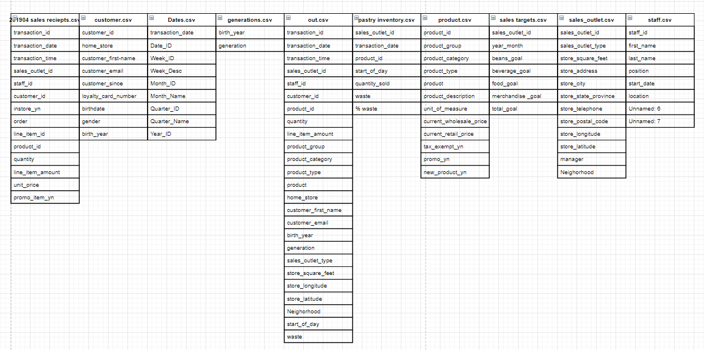

# boring-rescue-open

Recently, I found out that I dedicate little to no time in volunteering. And someone hit me hard with this phrase:

"你没有时间做不赚钱的东西"
("You don't do task that isn't profiting.")

Somehow I feel sad about this cold truth, and decided to dedicate a fraction amount of time to do what I enjoy, instead of only be attentive to my reponsibilities. Since it's not some super secret commisioned project, I feel comfortable to share it to everyone if they care. Hence born is this repository, about to filled with some stupid simple tools to make life easier.

## CSV Export to Draw.IO (UML)

Do you need to draw Database Schema / UML diagrams? And you need to pull a so many column names? Feel boring and error prone? Fret not, I feel you.

Draw.io is a free and awesome tool for drawing diagrams. So it would be nice if there's someone can pull those column names and export it to draw.io.....

### Manual

1. Clone this repo (or just download the folder: export-csv-to-drawio).
2. Place all your tables into the src_table folder.
3. Double click the export.bat (Or you prefer, python lazy.py)
4. Follow on screen insctructions.
5. Output will be a file name export.drawio
6. In draw.io, File > Import From > Device, select the file "export.drawio"
7. Smile for a moment as job is cut short, then cry silently to complete the rest of the work😂

### Sample Output

